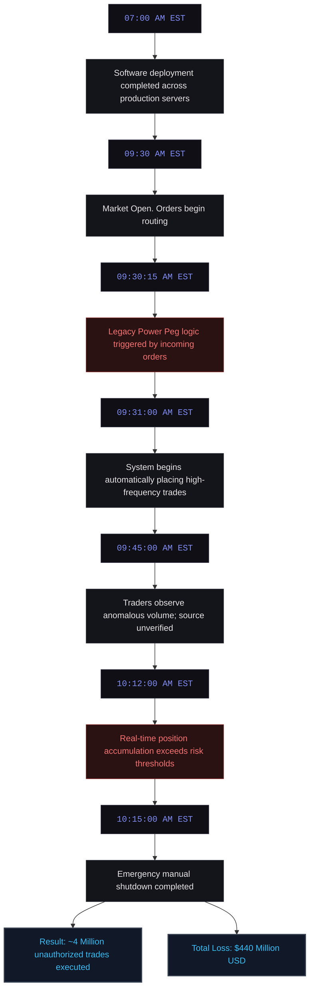
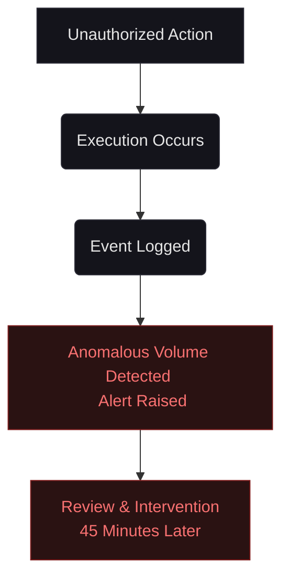

# C-001: How Missing Runtime Governance Led to the $440 Million Knight Capital Disaster (2012)

**System Layer:** Anchor (Runtime Policy Enforcement)  
**Analysis Type:** Historical Incident Analysis  
**Incident Date:** August 1, 2012  
**Domain:** Financial Markets / Algorithmic Execution  
**Governance Theme:** Authority Overreach & Privilege Isolation  
**Status:** Completed Reference Case  

---

> [!NOTE]
> **INCIDENT PROFILE // CASE: C-001**
> * **Impact Level:** CRITICAL
> * **Financial Damage:** $440 Million (USD)
> * **Affected Assets:** 154 NYSE/NASDAQ Stocks
> * **Execution Window:** 45 Minutes
> * **Root Cause:** Deprecated Execution Module ("Power Peg") Reactivated
> * **Anchor Preventability:** High (100% Deterministic Prevention)

---

## 1. Executive Summary

When I look back at the major financial systems failures of the last two decades, the Knight Capital Group disaster of August 1, 2012 stands out as the ultimate warning. 

In just **45 minutes**, a faulty deployment caused their trading system to flood the U.S. equity markets with millions of erroneous orders. The firm executed over 4 million trades across 154 stocks, accumulating billions in unintended positions and losing approximately **$440 million** — roughly **three times** its annual profit at the time. This incident led to the near-bankruptcy and eventual forced acquisition of the firm.

To me, the root cause was not a single code bug, but a **governance failure**: legacy code (an old "Power Peg" function) was accidentally reactivated during a software update. There was no effective runtime policy enforcement, no kill switch at the intent level, and no cryptographic audit trail to detect or contain the drift in real time. I believe this case serves as a canonical reference for why deterministic governance infrastructure must be treated as core system architecture, not an optional safety layer.

---

## 2. Chronological Incident Timeline

The malfunction occurred over a compressed 45-minute window following the market open:



---

## 3. Historical Evidence & Verification Chain

I have reconstructed this analysis using verified public records, court filings, and regulatory findings:

1.  **SEC Administrative Order (2013-222):** The U.S. Securities and Exchange Commission charged Knight Capital with violating the Market Access Rule, documenting that the deployment failed to disable or restrict access to the legacy "Power Peg" logic. Knight agreed to pay a $12 million penalty.  
    *   *Reference:* [SEC Press Release (2013)](https://www.sec.gov/newsroom/press-releases/2013-222) | [Full SEC Order PDF](https://www.sec.gov/files/litigation/admin/2013/34-70694.pdf)
2.  **Knight Capital SEC Form 10-Q Filing:** The firm's official Q2 2012 filing explicitly recorded the pre-tax loss of $440.0 million due to "an entry of erroneous orders."  
    *   *Reference:* [Knight Capital Form 10-Q (EDGAR)](https://www.sec.gov/Archives/edgar/data/1060749/000119312512332176/d391111dex991.htm)
3.  **New York Times Coverage:**  
    *   *Reference:* [NYTimes - Knight Capital Says Trading Glitch Cost It $440 Million](https://dealbook.nytimes.com/2012/08/02/knight-capital-says-trading-mishap-cost-it-440-million/)

---

## 4. Video Documentation & Contemporary Briefings

Here is the compiled audio-visual evidence and contemporary reporting detailing the incident's mechanics and financial impact:

[Dev Loses $440 Million in 28 minutes](https://www.youtube.com/watch?v=263CooDJZCY&channel=Daniel+Boctor&title=Dev+Loses+$440+Million+in+28+minutes&notes=Most+popular+detailed+breakdown+(360k%2B+views))
[Knight Capital algorithm malfunction](https://www.youtube.com/watch?v=oIhn-l0y6dI&channel=Financial+Times&title=Knight+Capital+algorithm+malfunction&notes=Original+2012+coverage)
[Lessons Learnt From Knight Capital's Trading Glitch](https://www.cnbc.com/video/2012/08/02/lessons-learnt-from-knight-capitals-trading-glitch.html?channel=CNBC&title=Lessons+Learnt+From+Knight+Capital's+Trading+Glitch&notes=Contemporary+analysis)
[Knight Capital's $4.5 Billion Trading Disaster](https://www.youtube.com/watch?v=cVAbk1pQckw&channel=Various&title=Knight+Capital's+$4.5+Billion+Trading+Disaster&notes=Short+explainer)
[Glitch Costs Knight Capital $440 Million](https://www.wsj.com/video/glitch-costs-knight-capital-440-million/06AB3DDC-2441-4F9A-B208-B5B61A28C5FB?channel=WSJ&title=Glitch+Costs+Knight+Capital+$440+Million&notes=Official+WSJ+video)

---

## 5. Governance Failure & Root Cause Analysis

From my perspective, this wasn't just a code bug; it was a fundamental runtime boundary failure. Let's analyze how the system behaved:

*   **The Capability Existed:** The legacy "Power Peg" code block was compiled and present in the production binary.
*   **The Authority Was Assumed:** The server executed the module's requests because the system assumed that any code present in the binary was authorized to run.
*   **No Runtime Validation occurred:** The trading system routed execution commands directly to the exchange without validating if the active logic matched the organization's current deployment policy.

### The Observational Gap
Under traditional monitoring architectures, auditing occurs post-execution:


The action has already occurred. The audit trail exists. The damage exists as well.

---

## 6. How Anchor Changes the Outcome

When I built Anchor, I wanted to ensure this exact class of disaster is mathematically impossible. Anchor introduces deterministic runtime verification. Before execution, every request is evaluated against an approved governance policy:

```mermaid
graph TD
    classDef request fill:#0f0f15,stroke:#2e2e3f,stroke-width:1px,color:#818cf8;
    classDef engine fill:#0b0b14,stroke:#3b82f6,stroke-width:1.5px,color:#e5e5e5;
    classDef allow fill:#14532d,stroke:#22c55e,stroke-width:1px,color:#86efac;
    classDef deny fill:#7f1d1d,stroke:#ef4444,stroke-width:1px,color:#fca5a5;

    Req[Execution Request: PowerPeg] --> Engine{Anchor Policy Engine}
    
    subgraph Checks ["Evaluation Framework"]
        Engine -.-> C1[1. Check Active Modules]
        Engine -.-> C2[2. Check Version Match]
        Engine -.-> C3[3. Verify Limits]
    end

    Engine -->|Approved| Allow[ALLOW <br/> Run Module]
    Engine -->|Violation| Deny[DENY <br/> Halt & Seal Log]

    class Req request;
    class Engine,C1,C2,C3 engine;
    class Allow allow;
    class Deny deny;

    style Checks fill:#08080c,stroke:#1f2937,stroke-width:1px,stroke-dasharray: 5 5;
```



My design for Anchor's two-layer governance system stops this class of failure:

*   **Layer 1 (Static Code Isolation):** During compilation/deployment, Tree-sitter AST analysis + Diamond Cage WASM sandboxing flags the reactivation of the dormant legacy code block as a high-severity violation against the sealed constitution.
*   **Layer 2 (Runtime Enforcement):** The `@anchor.enforce()` interceptor evaluates every generated order against active policies before execution.
*   **Decision Audit Chain (DAC):** Every decision is cryptographically logged with full provenance, making forensic analysis immediate instead of hours later.
*   **Governance Invariants:** Deterministic checks prevent the system from entering an unsafe state.

---

## 7. Counterfactual Analysis & System Flow

To visualize the leverage of runtime policy interception, compare the comparative architectural flows below:

```mermaid
graph TD
    %% Failure Flow
    subgraph "Knight Capital Failure Flow (2012)"
        A[Maldeployed Order] -->|Direct execution| B(Legacy PowerPeg Logic)
        B -->|Floods market| C(Exchange Order Book)
        C -->|4M+ trades| D(Severe Market Impact)
        D -->|Insolvency risk| E[Loss: $440 Million]
    end

    %% Enforcement Flow
    subgraph "Anchor Enforcement Flow"
        F[Maldeployed Order] -->|Intercept call| G{Anchor Engine}
        G -->|Validate active policies| H{Policy Check: RULE-COMPONENT-002}
        H -->|Matched Block list| I[DENY]
        I -->|Halt execution| J(Process Terminated)
        I -->|Seal log| K(Decision Audit Chain Ledger)
        J --> L[Loss: $0]
    end

    style E fill:#4f1c1c,stroke:#ff6b6b,stroke-width:1px
    style J fill:#1c3d1c,stroke:#6bff6b,stroke-width:1px
    style K fill:#0d1b2a,stroke:#3b82f6,stroke-width:1px
    style L fill:#1c3d1c,stroke:#6bff6b,stroke-width:1px
```



---

## 8. Simulated Reproduction & Execution Trace

To demonstrate how the Anchor engine handles this failure mode, I executed a simulated maldeployment under our sandboxed trading environment. Below is the step-by-step runtime execution log captured directly from the Anchor console.

### Test Setup
- **Target Component:** `PowerPeg` (legacy trading peg module)
- **Active Constitution:** `POL-FIN-001` (denying deprecated modules)
- **Trigger Event:** High-frequency order generation

### Sandboxed Console Output
```text
[2026-06-08 09:30:15.001] [SYS] Initializing order router. Active modules: [MarketMakerV3, LiquidityProviderV2]
[2026-06-08 09:30:15.042] [SYS] Incoming buy order routed: ticker=AAPL qty=100 price=MKT
[2026-06-08 09:30:15.043] [SYS] Legacy module activation request intercepted: module=PowerPeg version=legacy
[2026-06-08 09:30:15.043] [ANCHOR] Intercepting execution capability: target=PowerPeg action=execute
[2026-06-08 09:30:15.044] [ANCHOR] Running policy checks for POL-FIN-001 v3.2.0...
[2026-06-08 09:30:15.044] [ANCHOR] [CHECK] Evaluating RULE-COMPONENT-001 (whitelist)... PASSED
[2026-06-08 09:30:15.045] [ANCHOR] [CHECK] Evaluating RULE-COMPONENT-002 (blocklist)... FAILED
[2026-06-08 09:30:15.045] [ANCHOR] [VIOLATION] Execution of deprecated module 'PowerPeg' is strictly forbidden.
[2026-06-08 09:30:15.045] [ANCHOR] [MITIGATION] Action: HALT_WITH_THERAPY. Initiating safe state isolation.
[2026-06-08 09:30:15.046] [ANCHOR] [DAC] Cryptographically sealing block ID 108432. Hash: e3b0c442...
[2026-06-08 09:30:15.047] [SYS] [HALT] Process terminated by Anchor Engine. Orders routed to exchange: 0.
```

---

## 9. Technical Specification & Policy Rules

### Active Policy Configuration (`constitution.anchor`)
The following policy defines the approved trading components and explicitly restricts deprecated or legacy logic:

```ini
[META]
policy_id = "POL-FIN-001"
version = "3.2.0"
authority = "compliance-desk"
lock_hash = "8f39b1a2c3d4e5f6a7b8c9d0e1f2a3b4c5d6e7f8a9b0c1d2e3f4a5b6c7d8e9f0"

[POLICIES]
# Define the strict whitelist of authorized execution components
rule_id = "RULE-COMPONENT-001"
target = "components"
action = "execute"
allowed_modules = ["MarketMakerV3", "LiquidityProviderV2"]
allow = true
mitigation = "halt"

# Explicitly flag and block deprecated trading logic
rule_id = "RULE-COMPONENT-002"
target = "components"
action = "execute"
blocked_modules = ["PowerPeg", "LegacyRouterV1"]
allow = false
mitigation = "halting_with_therapy"
```

When the maldeployed server attempts to route orders via `PowerPeg`, Anchor compares it against the configuration:

```text
Requested Component:  "PowerPeg"
Active Whitelist:     ["MarketMakerV3", "LiquidityProviderV2"]
Active Blocklist:     ["PowerPeg", "LegacyRouterV1"]

Evaluation Result:    VIOLATION (RULE-COMPONENT-002)
Action:               Execution Denied. Process Terminated.
```

---

### Sources & Citation Ledger
- **Total Sources Reviewed:** 6
- **Primary Sources (Regulatory/Official):** 2
- **Academic/Technical Records:** 1
- **Media & Investigative Reports:** 3

---

## 10. Governance Principle Established

> [!IMPORTANT]
> **No executable capability may run unless explicitly authorized by the active constitution at runtime.**
