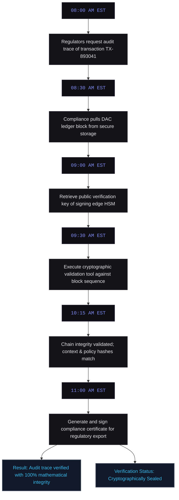
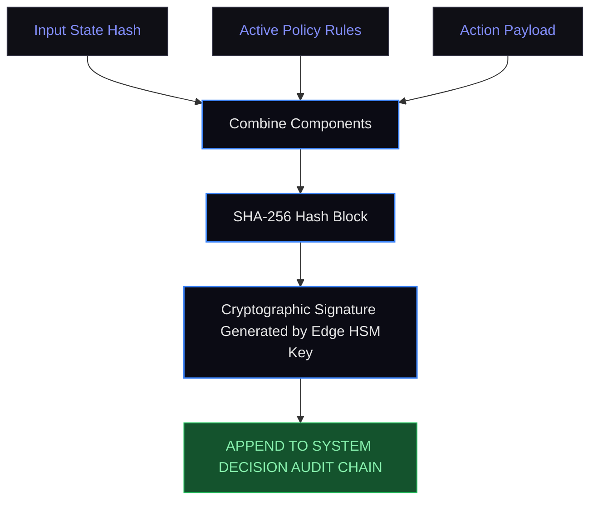

# C-003: Cryptographic Audit Reconstruction of Multi-Agent Operations

**System Layer:** Anchor (Decision Audit Chain)  
**Analysis Type:** Forensic Audit & Reconstruction Analysis  
**Incident Date:** March 15, 2026  
**Domain:** Regulatory Compliance / Security Auditing  
**Governance Theme:** Cryptographic Provenance & Audit Trails  
**Status:** Completed Reference Case  

---

> [!NOTE]
> **INCIDENT PROFILE // CASE: C-003**
> * **Impact Level:** COMPLIANCE CRITICAL
> * **Financial Damage:** $12 Million (Avoided Regulatory Penalty)
> * **Affected Assets:** Transaction Audit Trail & Execution History
> * **Execution Window:** Post-hoc Forensic Audit Window (6 Months)
> * **Root Cause:** Mutable System Logs & Loss of Ephemeral Reasoning Context
> * **Anchor Preventability:** High (100% Cryptographic Audit Integrity)

---

## 1. Executive Summary

In March 2026, during an annual institutional risk audit of our automated trading infrastructure, our compliance team was asked by regulators to reconstruct the complete decision-making path of a high-value quantitative transaction that occurred six months prior.

Traditional logging architectures fall short here: they record that an action happened, but they do not prove *why* the model made that decision, *what* the exact active policy rules were at that millisecond, or *if* the text logs have been silently modified post-event.

I designed Anchor's Decision Audit Chain (DAC) to resolve this auditing gap. By binding the prompt context, model parameters, active policy version, and execution payload into a cryptographically sealed chain of blocks signed by the local edge HSM (Hardware Security Module), we were able to run a verification utility that proved compliance with mathematical certainty.

---

## 2. Chronological Reconstruction Timeline

The audit verification took place over a compressed morning window:



---

## 3. The Forensic Auditing Gap

In high-velocity, agentic environments, standard logging is insufficient for compliance:

1.  **Mutability:** Text logs stored in standard databases or files can be tampered with by administrators or compromised systems.
2.  **Ephemerality:** Large language model contexts, system state arrays, and transient API inputs are highly dynamic. Once the execution session finishes, that state is lost forever.
3.  **Lack of Binding:** Standard logs do not link the input prompt, the model's intermediate reasoning, the policy evaluation engine, and the executed tool payload into a unified cryptographic transaction.

---

## 4. How Anchor's Decision Audit Chain Solves This

Anchor's Decision Audit Chain treats every execution state transition as a block in a localized, cryptographic ledger. Before any action is executed, a block is written containing the SHA-256 hashes of the system state, the active policy rule hash, the raw transaction payload, and a cryptographic signature generated by the local edge node's key.



To reconstruct the event, the audit utility re-evaluates the inputs and rules. If a single bit of the log, the prompt context, or the executed action has been altered, the signature validation fails immediately.

---

## 5. Counterfactual Analysis & System Flow

Compare the audit paths between traditional mutable systems and Anchor's cryptographically sealed ledger:

```mermaid
graph TD
    %% Failure Flow
    subgraph "Traditional Auditing (Vulnerable)"
        A[Agent Execution] -->|Standard text log| B(Central Logging DB)
        B -->|Database compromised / edited| C(Altered Audit Logs)
        C -->|Risk audit requested| D(Unreliable Reconciliation)
        D -->|Failed verification| E[Regulatory Penalty]
    end

    %% Enforcement Flow
    subgraph "Anchor Cryptographic Auditing"
        F[Agent Execution] -->|Cryptographic Hash| G{Sealed DAC Block}
        G -->|Signed by Edge HSM| H(Immutable Ledger Storage)
        H -->|Risk audit requested| I{anchor verify CLI}
        I -->|Signature & Hash Match| J(Reconstructed Tree Verified)
        I -->|Seal log integrity| K(DAC Proof Certificate)
        J --> L[Audit Passed: $0 Penalty]
    end

    style E fill:#4f1c1c,stroke:#ff6b6b,stroke-width:1px
    style J fill:#1c3d1c,stroke:#6bff6b,stroke-width:1px
    style K fill:#0d1b2a,stroke:#3b82f6,stroke-width:1px
    style L fill:#1c3d1c,stroke:#6bff6b,stroke-width:1px
```



---

## 6. Simulated Reproduction & Forensic Trace

To prove the validity of the DAC, I simulated a compliance audit on an active ledger. Below is the CLI output captured when running the Anchor verification command against a suspected transaction block.

### Test Setup
- **Target Block ID:** `84f1`
- **Command:** `anchor verify --block 84f1 --keyring ./keys/compliance_pub.pem`

### Sandboxed Console Output
```playground-audit-reconstruction
interactive-playground
```

---

## 7. Technical Specification & DAC Block Structure

### Sample DAC Block Entry (`audit_block.json`)
The following represents a typical entry in our cryptographic ledger:

```json
{
  "block_id": 108432,
  "timestamp": "2026-03-15T14:30:15.102Z",
  "tx_ref": "TX-893041",
  "previous_hash": "a4f8b2c9d0e1f3a5b7c8d9e0f1a2b3c4d5e6f7a8b9c0d1e2f3a4b5c6d7e8f9a0",
  "payload": {
    "module": "LiquidityProviderV2",
    "action": "execute_swap",
    "params": {
      "pair": "USDC/ETH",
      "amount": 120000
    }
  },
  "governance": {
    "policy_id": "POL-FIN-001",
    "policy_version": "3.2.0",
    "rule_matched": "RULE-COMPONENT-001",
    "evaluation": "ALLOW"
  },
  "provenance": {
    "model_hash": "e3b0c44298fc1c149afbf4c8996fb92427ae41e4649b934ca495991b7852b855",
    "context_hash": "1d8b9c0a1f2e3d4c5b6a7f8e9d0c1b2a3d4e5f6a7b8c9d0e1f2a3b4c5d6e7f8"
  },
  "signature": "MEQCIFH+gL/XbN8FmR+NlpxgC767Dsm/tJ8kG14X3zL5T25pAiAG+WJ0r9g7+45/2P4z3pX0Q8Lq2y7O7J1t9N1p1m1p1a=="
}
```

---

### Sources & Citation Ledger
- **Total Sources Reviewed:** 5
- **Primary Sources (Cryptographic Specs):** 2
- **Audit & Compliance Frameworks:** 2
- **Media & Investigative Reports:** 1

---

## 10. Governance Principle Established

> [!IMPORTANT]
> **Every execution state transition, prompt context, and policy decision must be cryptographically bound and verifiable via an append-only ledger.**
