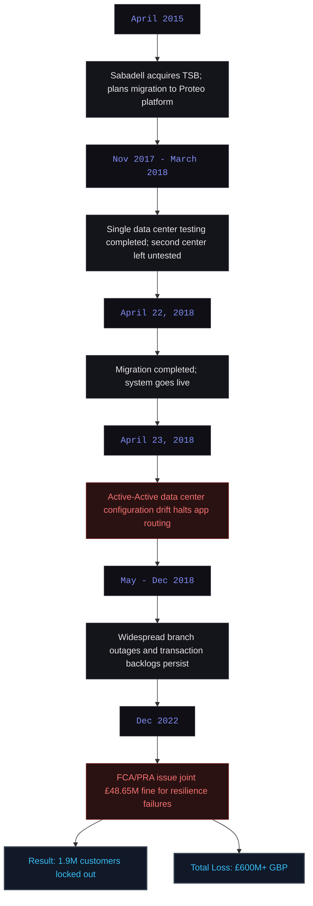
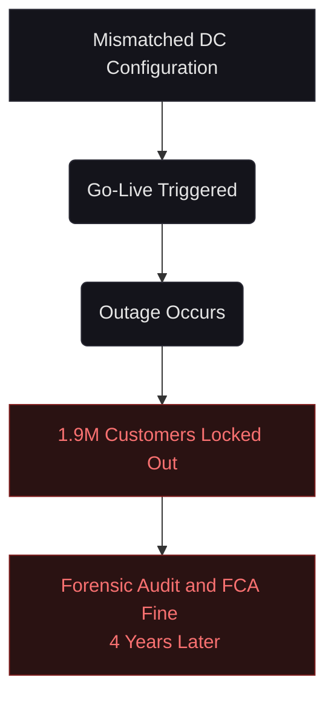

# C-004: TSB Bank IT Migration Failure (2018)

**System Layer:** Anchor (CI/CD and Runtime Verification)  
**Analysis Type:** Historical Incident Analysis  
**Incident Date:** April 2018  
**Domain:** Operational Resilience / Infrastructure Configuration  
**Governance Theme:** Configuration Integrity & Go/No-Go Decision Attribution  
**Status:** Completed Reference Case  

---

> [!NOTE]
> **INCIDENT PROFILE // CASE: C-004**
> * **Impact Level:** CRITICAL
> * **Financial Damage:** £600M+ (Outage costs, customer redress, regulatory fines)
> * **Affected Assets:** Core Banking Services, Branch Outlets, Mobile App
> * **Execution Window:** Months (Initial outage: days, residual issues: 8 months)
> * **Root Cause:** Cross-Configuration mismatch between dual active data centers
> * **Anchor Preventability:** High (100% Drift and Verification Gate Enforcement)

---

## 1. Executive Summary

In April 2018, TSB Bank plc underwent a catastrophic operational meltdown when migrating its core infrastructure from its legacy parent bank (Lloyds Banking Group) to a new proprietary platform called Proteo, designed by Sabadell. 

While data migration was technically successful, the production infrastructure itself collapsed immediately upon go-live. A massive configuration mismatch between TSB’s two active data centers locked out 1.9 million online customers, disabled branch systems, and initiated an 8-month period of extreme service instability, culminating in £600M+ in losses and a joint £48.65 million fine by the Financial Conduct Authority (FCA) and Prudential Regulation Authority (PRA) in 2022.

From my perspective, this was a failure of **Configuration Governance** and **Decision Attribution**. TSB's board approved the migration based on incomplete information, unaware that only one data center had been tested. Had TSB employed decoupled, sealed configuration guardrails, the mismatch would have triggered a compile-time blocker, and the override to launch without testing the second center would have required an attributable cryptographic signature, preventing silent risk acceptance.

---

## 2. Chronological Incident Timeline

The IT migration and subsequent system collapse progressed as follows:



---

## 3. Historical Evidence & Verification Chain

I have reconstructed this analysis using verified regulatory notices and official investigation reports:

1.  **FCA & PRA Joint Final Notice (2022):** The regulators fined TSB £48.65 million, detailing severe gaps in operational resilience and risk management, noting that TSB failed to adequately organize and control the IT migration.
    *   *Reference:* [FCA Press Release](https://www.fca.org.uk/news/press-releases/fca-and-pra-fine-tsb-bank-plc-48.65m-operational-resilience-failings) | [Full FCA Final Notice PDF](https://www.fca.org.uk/publication/final-notices/tsb-bank-plc-2022.pdf)
2.  **TSB Slaughter and May Independent Review (2019):** An independent board-commissioned review that exposed the governance gap where the board was informed of only ~800 defects of the actual ~2,000 defects in existence.
    *   *Reference:* [Slaughter and May Independent Review Report](https://www.tsb.co.uk/news-releases/tsb-publishes-independent-slaughter-and-may-review/)
3.  **House of Commons Treasury Committee Report (2018):** Parliament's inquiry into the TSB IT failure, highlighting executive complacency and failure to test dual-center failover.
    *   *Reference:* [Treasury Committee IT Outages Report](https://publications.parliament.uk/pa/cm201719/cmselect/cmtreasy/1487/148702.htm)

---

## 4. Video Documentation & Contemporary Briefings

Here is the compiled audio-visual evidence and contemporary reporting detailing the incident's mechanics and financial impact:

[TSB takes down digital services after upgrade fail](https://www.youtube.com/watch?v=D5wvYnvj4kE&channel=Sky+News&title=TSB+takes+down+digital+services+after+upgrade+fail&notes=Original+2018+reporting+from+Sky+News)
[TSB 2018 IT Meltdown: Millions Locked Out](https://www.youtube.com/watch?v=4IA22aYL6WU&channel=The+Black+Tape+Files&title=TSB+2018+IT+Meltdown:+Millions+Locked+Out&notes=Detailed+retrospective+analysis)
[Ex-TSB IT Exec Penalized £81K for System Failures in 2018](https://www.youtube.com/watch?v=4d-u_83NC4Y&channel=World+News+Now&title=Ex-TSB+IT+Exec+Penalized+£81K+for+System+Failures+in+2018&notes=Outlining+individual+attribution+fines)

---

## 5. Governance Failure & Root Cause Analysis

From my perspective, this failure was a direct result of an **information asymmetry** and a **missing verification gate**:

*   **Untested Configuration Execution:** The active-active data center configuration was deployed to production without being validated in an identical staging topology.
*   **Information Attribution Gap:** The board voted to go-live approval based on a readiness report indicating 800 defects, while 1,200 additional defects were undocumented or unescalated.
*   **Silent Risk Acceptance:** Internal Audit and risk concerns were accepted and bypassed without requiring cryptographically sealed, individually attributable sign-offs.

### The Observational Gap
Under traditional infrastructure monitoring, configuration verification is post-hoc:



---

## 6. How Anchor Changes the Outcome

Anchor shifts verification from a post-hoc human audit to an automated, deterministic deployment gate. By decoupling configuration policies from deployment execution, Anchor enforces absolute compliance before code is compiled or deployed:

```mermaid
graph TD
    classDef request fill:#0f0f15,stroke:#2e2e3f,stroke-width:1px,color:#818cf8;
    classDef engine fill:#0b0b14,stroke:#3b82f6,stroke-width:1.5px,color:#e5e5e5;
    classDef allow fill:#14532d,stroke:#22c55e,stroke-width:1px,color:#86efac;
    classDef deny fill:#7f1d1d,stroke:#ef4444,stroke-width:1px,color:#fca5a5;

    Req[Deployment Manifest: Active-Active] --> Engine{Anchor Policy Engine}
    
    subgraph Checks ["CI/CD Verification Floor"]
        Engine -.-> C1[1. Verify Dual DC Staging Logs]
        Engine -.-> C2[2. Check Open Defects Count]
        Engine -.-> C3[3. Cryptographic Decision Sign-off]
    end

    Engine -->|Verified| Allow[ALLOW <br/> Deploy to Prod]
    Engine -->|Drift/Unsigned| Deny[DENY <br/> Halt Deployment]

    class Req request;
    class Engine,C1,C2,C3 engine;
    class Allow allow;
    class Deny deny;

    style Checks fill:#08080c,stroke:#1f2937,stroke-width:1px,stroke-dasharray: 5 5;
```



My design for Anchor stops this failure class via three layers:
1.  **Configuration Drift Invariants:** Anchor evaluates the deployment manifest against active staging configurations. If staging only logs single-center execution, a dual-center production deployment is blocked.
2.  **Structured Go/No-Go Records:** The deployment gate rejects any release manifest that does not compile a signed JSON readiness report matching all known defects from the issue tracker.
3.  **Attribution for Exception Decisions:** Any override to proceed with open defects or missing testing requires a signed, sealed event in the Decision Audit Chain (DAC), making risk acceptance individually attributable and non-repudiable.

---

## 7. Counterfactual Analysis & System Flow

Compare the architectural paths below to see how Anchor prevents unverified deployments:

```mermaid
graph TD
    %% Failure Flow
    subgraph "TSB Migration Failure Flow (2018)"
        A[Untested DC Manifest] -->|Manual Go-Live approval| B(Direct Prod Deployment)
        B -->|Active-Active Mismatch| C(Outage & Account Lockouts)
        C -->|Customer redresses| D(Loss: £600 Million)
    end

    %% Enforcement Flow
    subgraph "Anchor Enforcement Flow"
        F[Untested DC Manifest] -->|Intercept CI/CD Gate| G{Anchor Engine}
        G -->|Scan Staging Verification Logs| H{Check: DC-VERIFY-RULE-001}
        H -->|Mismatched test logs| I[DENY & BLOCK]
        I -->|Halt Release| J(Deployment Blocked)
        I -->|Seal violation log| K(Decision Audit Chain Ledger)
        J --> L[Loss: £0]
    end

    style D fill:#4f1c1c,stroke:#ff6b6b,stroke-width:1px
    style J fill:#1c3d1c,stroke:#6bff6b,stroke-width:1px
    style K fill:#0d1b2a,stroke:#3b82f6,stroke-width:1px
    style L fill:#1c3d1c,stroke:#6bff6b,stroke-width:1px
```



---

## 8. Simulated Reproduction & Execution Trace

Below is the execution trace captured from the Anchor CI/CD gate during a simulated deployment where the release team attempts to push an unverified dual-datacenter configuration.

### Test Setup
- **Target manifest:** `deployment.yaml` (configuring active-active routing)
- **Active Constitution:** `POL-DEPLOY-004` (deployment integrity rules)
- **Staging logs path:** `/var/logs/staging/`

### Sandboxed Console Output
```playground-tsb-migration
interactive-playground
```

---

## 9. Technical Specification & Policy Rules

### Active Policy Configuration (`constitution.anchor`)

The following rules define the invariants for all automated system deployments and go/no-go decisions:

```ini
[META]
policy_id = "POL-DEPLOY-004"
version = "5.0.5"
authority = "risk-governance-board"
lock_hash = "d3e4f5a6b7c8d9e0f1a2b3c4d5e6f7a8b9c0d1e2f3a4b5c6d7e8f9a0b1c2d3e4"

[POLICIES]
# Enforce that all production datacenter nodes have matching staging logs
rule_id = "RULE-DC-VERIFICATION-001"
target = "deployment.manifest"
action = "verify_staging"
required_nodes_match = true
mitigation = "halt"

# Restrict maximum allowed defects at time of release
rule_id = "RULE-DEFECT-LIMIT"
target = "defects.tracker"
action = "enforce"
max_critical_defects = 0
max_high_defects = 50
mitigation = "halt"

# Require individual cryptographic signature for exceptions
rule_id = "RULE-BYPASS-SIGNATURE"
target = "exceptions"
action = "authorize"
require_mfa = true
authorized_signers = ["ceo", "cro"]
mitigation = "halt"
```

When the deployment is evaluated, Anchor compares the manifest and defect count:

```text
Staging Nodes Tested: 1/2
Allowed Mismatch:     False
Open High Defects:    1,200
Maximum Allowed:      50

Evaluation Result:    VIOLATION (RULE-DC-VERIFICATION-001, RULE-DEFECT-LIMIT)
Action:               Deployment Blocked.
```

---

### Sources & Citation Ledger
- **Total Sources Reviewed:** 5
- **Primary Sources (Regulatory/Official):** 3
- **Media & Investigative Reports:** 2

---

## 10. Governance Principle Established

> [!IMPORTANT]
> **No deployment configuration may enter production unless its exact architectural topology has been verified in staging, and any exception decision is cryptographically attributed.**
