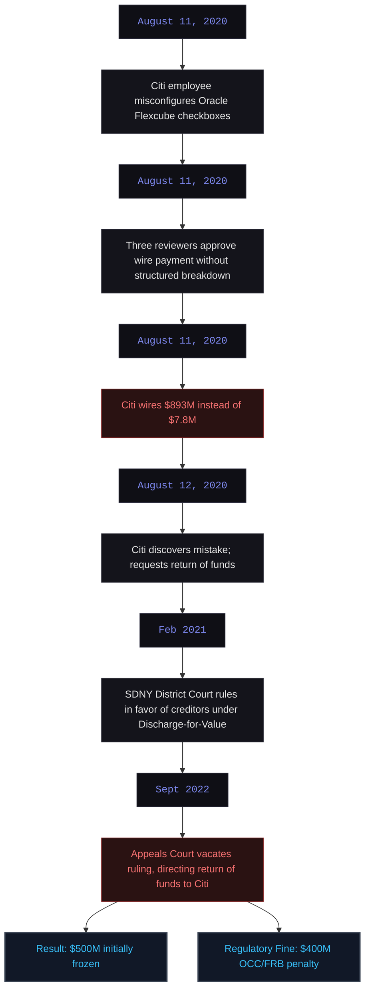
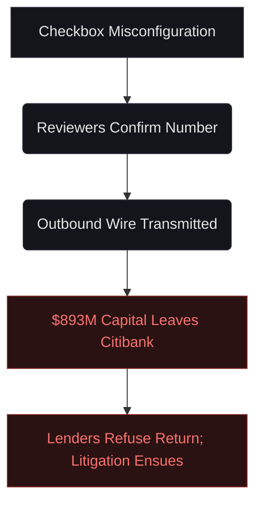

# C-005: Citibank Revlon Wire Transfer Error (2020)

**System Layer:** Anchor Engine  
**Analysis Type:** Historical Incident Analysis  
**Incident Date:** August 2020  
**Domain:** Financial Transactions / Risk Management  
**Governance Theme:** Authorization Controls & Structured Intent Verification  
**Status:** Completed Reference Case  

---

> [!NOTE]
> **INCIDENT PROFILE // CASE: C-005**
> * **Impact Level:** CRITICAL
> * **Financial Damage:** ~$500 Million (USD) net loss (unreturned funds)
> * **Affected Assets:** Administrative Agent Payment Pipeline, Oracle Flexcube System
> * **Execution Window:** Less than 24 hours (transaction execution and next-day discovery)
> * **Root Cause:** Employee error due to confusing UI checkboxes, combined with a "six-eyes" approval process that lacked structured breakdown visualization
> * **Anchor Preventability:** High (100% Structured mode validation and amount-range constraint enforcement)

---

## 1. Executive Summary

On August 11, 2020, Citibank, acting as the administrative agent for a syndicated loan to Revlon Inc., intended to transmit a routine interest payment of $7.8 million to Revlon's creditors. Instead, due to a confusing user interface in the bank's loan processing software (Oracle Flexcube) and a human validation failure, Citibank accidentally wired $893 million of its own capital—effectively paying off the entire principal of the loan three years ahead of schedule.

Although some creditors returned the funds, ten lenders representing approximately $500 million refused, citing the "discharge-for-value" rule under New York law. After two years of litigation, Citibank settled to recover about three-quarters of the mistaken payments, but the incident remains "one of the biggest blunders in banking history" and resulted in a $400 million regulatory fine.

From my perspective, this was a failure of **Intent Authorization Governance**. Three independent human reviewers approved the transaction, yet all three missed the error because they were presented with a raw payment amount without a structured breakdown of the payment's component obligations (interest vs. principal, authorized range, and funding source). Had Citibank enforced a **No-Prose Rule** requiring transactions to be validated against machine-readable policy ranges at runtime, the $893M transaction would have been blocked automatically.

---

## 2. Chronological Incident Timeline

The payment blunder, legal battle, and resolution proceeded as follows:



---

## 3. Historical Evidence & Verification Chain

I have reconstructed this analysis using the official court filings and regulatory orders:

1.  **District Court Ruling (Citibank N.A. v. Brigade Capital Management):** U.S. District Judge Jesse Furman's initial opinion detailing the mechanics of the "six-eyes" approval failure and the Oracle Flexcube interface.
    *   *Reference:* [SDNY District Court Case Docket on CourtListener](https://www.courtlistener.com/docket/17448378/citibank-na-v-brigade-capital-management-lp/) | [Full District Court Opinion PDF](https://www.nysd.uscourts.gov/sites/default/files/2021-02/20cv6539%20Opinion.pdf)
2.  **Second Circuit Appeals Court Ruling (2022):** The appeals court opinion reversing the district court's decision, clarifying that the creditors should have known it was a mistake.
    *   *Reference:* [Second Circuit Court of Appeals Opinion PDF](https://www.ca2.uscourts.gov/decisions/isysquery/5f7b49db-84b2-4d43-a60d-7711202e8647/1/doc/21-487_opn.pdf)
3.  **OCC Consent Order (2020-058):** The Office of the Comptroller of the Currency fined Citibank $400 million for long-standing deficiencies in its enterprise-wide risk management, data governance, and internal controls.
    *   *Reference:* [OCC Consent Order Press Release](https://www.occ.gov/news-issuances/news-releases/2020/nr-occ-2020-132.html) | [Consent Order PDF](https://www.occ.gov/static/enforcement-actions/ea2020-058.pdf)

---

## 4. Video Documentation & Contemporary Briefings

Here is the compiled audio-visual evidence and contemporary reporting detailing the incident's mechanics and financial impact:

[The $900M Checkbox: How Citibank Accidentally Gave Away a Fortune](https://www.youtube.com/watch?v=zvl2tiKv8Io&channel=DualEntry+%7C+The+AI-native+ERP&title=The+%24900M+Checkbox%3A+How+Citibank+Accidentally+Gave+Away+a+Fortune&notes=Detailed+UX+and+software+flowchart+breakdown)
[Citibank $900M Wire Mistake Explained](https://www.youtube.com/watch?v=C-xH3a3-3gc&channel=The+Financial+Controller&title=Citibank+%24900M+Wire+Mistake+Explained&notes=Accounting+and+internal+controls+perspective)
[Citi’s $900 Million Revlon Gaffe Resurfaces](https://www.youtube.com/watch?v=nGdnq5XwfjM&channel=Bloomberg+Television&title=Citi%27s+%24900+Million+Revlon+Gaffe+Resurfaces&notes=Bloomberg+report+on+the+appeals+court+ruling)

---

## 5. Governance Failure & Root Cause Analysis

From my perspective, this failure was caused by the lack of **Semantic Constraints** on the transaction intent:

*   **Prose / Unstructured Authorization:** Reviewers approved the transaction based on a single aggregate number. The system did not require them to verify a structured JSON record containing the transaction's semantic components (e.g., classifying $7.8M as interest and $885M as principal).
*   **Missing Invariant Bounds:** The system lacked range-checks to compare the payment intent against the authorized interest-only payment schedule.
*   **The Checkbox Mismatch:** The software relied on a confusing interface configuration (requiring "Principal" to be paid but directed to a wash account, which was missed) without verifying that the net outbound cash matched the active authorization contract.

### The Observational Gap
Under traditional approval systems, verification occurs after approval and transmission:



---

## 6. How Anchor Changes the Outcome

Anchor implements a **Structured Mode** validation model. Under this model, high-stakes system actions (such as payment processing) are intercepted, and their execution intents are parsed into machine-readable JSON fields. Anchor evaluates this intent against the active policy bounds before releasing the transaction:

```mermaid
graph TD
    classDef request fill:#0f0f15,stroke:#2e2e3f,stroke-width:1px,color:#818cf8;
    classDef engine fill:#0b0b14,stroke:#3b82f6,stroke-width:1.5px,color:#e5e5e5;
    classDef allow fill:#14532d,stroke:#22c55e,stroke-width:1px,color:#86efac;
    classDef deny fill:#7f1d1d,stroke:#ef4444,stroke-width:1px,color:#fca5a5;

    Req[Wire Intent: $893M] --> Engine{Anchor Policy Engine}
    
    subgraph Checks ["Structured Validation"]
        Engine -.-> C1[1. Parse Obligation Types]
        Engine -.-> C2[2. Compare to Authorized Range]
        Engine -.-> C3[3. Enforce Funding Source Bounds]
    end

    Engine -->|Approved| Allow[ALLOW <br/> Transmit Wire]
    Engine -->|Out of Range| Deny[DENY <br/> Block and Raise Alert]

    class Req request;
    class Engine,C1,C2,C3 engine;
    class Allow allow;
    class Deny deny;

    style Checks fill:#08080c,stroke:#1f2937,stroke-width:1px,stroke-dasharray: 5 5;
```



My design for Anchor's transaction protection stops this failure class:
1.  **The No-Prose Rule:** A transaction authorization cannot proceed unless the system generates a structured JSON validation record indicating: `interest_due`, `principal_due`, `net_outbound`, and `funding_source`.
2.  **Amount-Range Enforcement:** The policy engine enforces that the transaction amount cannot exceed the expected schedule (in this case, $7.8 million interest) by more than a defined variance (e.g., 5%) without an explicit, multi-signature override.
3.  **Active Lock Hash:** The transaction policy is cryptographically locked and checked at the gateway layer, preventing software-level UI misconfigurations from overriding the policy bounds.

---

## 7. Counterfactual Analysis & System Flow

Compare the architectural paths below to see how Anchor prevents authorization failures:

```mermaid
graph TD
    %% Failure Flow
    subgraph "Citibank Wire Failure Flow (2020)"
        A[Misconfigured UI Input] -->|Raw amount approved| B(Flexcube Core Execution)
        B -->|Wires $893M| C(Creditor Accounts)
        C -->|Discharge-for-Value dispute| D(Loss: ~$500 Million)
    end

    %% Enforcement Flow
    subgraph "Anchor Enforcement Flow"
        F[Misconfigured UI Input] -->|Intercept wire intent| G{Anchor Engine}
        G -->|Validate payment intent fields| H{Check: RULE-PAYMENT-LIMIT}
        H -->|Amount exceeds limit by 114x| I[DENY & BLOCK]
        I -->|Halt Wire Transfer| J(Transaction Halted)
        I -->|Seal log| K(Decision Audit Chain Ledger)
        J --> L[Loss: $0]
    end

    style D fill:#4f1c1c,stroke:#ff6b6b,stroke-width:1px
    style J fill:#1c3d1c,stroke:#6bff6b,stroke-width:1px
    style K fill:#0d1b2a,stroke:#3b82f6,stroke-width:1px
    style L fill:#1c3d1c,stroke:#6bff6b,stroke-width:1px
```



---

## 8. Simulated Reproduction & Execution Trace

Below is the execution trace captured from our payment gateway node when a client application attempts to submit a wire transaction that violates the active payment schedule limit.

### Test Setup
- **Payment Request:** `wire_transfer`
- **Payload:** `{"recipient": "Revlon Creditors", "amount_usd": 893000000.00, "type": "interest"}`
- **Active Policy:** `POL-FIN-005` (payment constraints)
- **Authorized Schedule:** Interest limit = $7,800,000.00 (Tolerance: 5%)

### Sandboxed Console Output
```playground-citibank-transfer
interactive-playground
```

---

## 9. Technical Specification & Policy Rules

### Active Policy Configuration (`constitution.anchor`)

The following rules define the payment constraints and Structured Mode requirements:

```ini
[META]
policy_id = "POL-FIN-005"
version = "1.0.2"
authority = "treasury-risk-committee"
lock_hash = "f5a6b7c8d9e0f1a2b3c4d5e6f7a8b9c0d1e2f3a4b5c6d7e8f9a0b1c2d3e4f5a6"

[POLICIES]
# Force all payment requests above $100K to run in Structured Mode
rule_id = "RULE-STRUCTURED-PAYMENTS"
target = "payments"
action = "enforce_mode"
mode = "structured"
required_fields = ["recipient", "amount_usd", "obligation_type", "funding_source"]
mitigation = "halt"

# Enforce strict transaction limits against the active payment schedule
rule_id = "RULE-PAYMENT-LIMIT"
target = "payments"
action = "check_range"
obligation_id_ref = "obligation_type"
max_tolerance_pct = 5.0
mitigation = "halt"

# Enforce dual-signature override for payments exceeding scheduled amount
rule_id = "RULE-OVERRIDE-LIMIT"
target = "payments"
action = "override"
allowed_override = false
mitigation = "halt"
```

When evaluated, Anchor checks the intent payload fields:

```text
Payload Mode:         Structured
Fields Present:       ["recipient", "amount_usd", "obligation_type", "funding_source"]
Validation Status:    PASS (RULE-STRUCTURED-PAYMENTS)

Scheduled Obligation: $7.8M
Submitted Amount:     $893M
Variance:             11,348.7% (Limit: 5%)
Override Allowed:     False

Evaluation Result:    VIOLATION (RULE-PAYMENT-LIMIT)
Action:               Transaction Blocked.
```

---

### Sources & Citation Ledger
- **Total Sources Reviewed:** 4
- **Primary Sources (Court Documents/Regulatory):** 3
- **Media & Investigative Reports:** 1

---

## 10. Governance Principle Established

> [!IMPORTANT]
> **If a transaction cannot be validated against its structured schedule and compliance policies at runtime, it must not be transmitted.**
