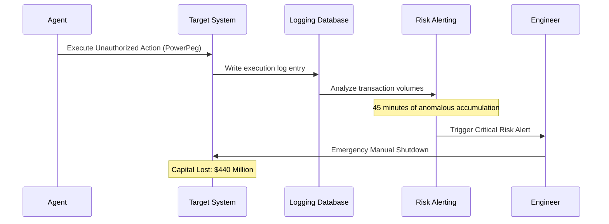

# C-001: Knight Capital Incident Distribution Assets Toolkit

This dossier contains the social, outreach, and visual distribution assets extracted from Case Study C-001 (The $440M Knight Capital Disaster). Use these materials to drive institutional traffic to `case.animuslab.dev/cases/001-authority-overreach`.

---

## 🏛️ 1. GitHub Reference
- **Canonical URL:** `https://github.com/AnimusLab/animuslab-case-studies/tree/main/anchor/001-authority-overreach`
- **Rendered Web Address:** `https://case.animuslab.dev/cases/001-authority-overreach`

---

## 📄 2. PDF Reference
- **Export Trigger:** Dynamic PDF rendering available on `case.animuslab.dev/cases/001-authority-overreach` via the **Export Dossier PDF** button (optimizes layout for academic print style, hiding web navigation elements).

---

## 📊 3. Visual Diagrams

### Diagram 1: The Failure Path vs. Anchor Enforcement Flow (Mermaid Source)

```mermaid
graph TD
    %% Failure Flow
    subgraph "Knight Capital Failure Flow (2012)"
        A[Maldeployed Order] -->|Direct execution| B(Legacy PowerPeg Logic)
        B -->|Floods market| C(Exchange Order Book)
        C -->|4M+ trades| D(Severe Market Impact)
        D -->|Insolvency risk| E[Loss: $440 Million]
    end

    %% Enforcement Flow
    subgraph "Anchor Enforcement Flow"
        F[Maldeployed Order] -->|Intercept call| G{Anchor Engine}
        G -->|Validate active policies| H{Policy Check: RULE-COMPONENT-002}
        H -->|Matched Block list| I[DENY]
        I -->|Halt execution| J(Process Terminated)
        I -->|Seal log| K(Decision Audit Chain Ledger)
        J --> L[Loss: $0]
    end

    style E fill:#4f1c1c,stroke:#ff6b6b,stroke-width:1px
    style J fill:#1c3d1c,stroke:#6bff6b,stroke-width:1px
    style K fill:#0d1b2a,stroke:#3b82f6,stroke-width:1px
    style L fill:#1c3d1c,stroke:#6bff6b,stroke-width:1px
```


### Diagram 2: The Observational Gap in Traditional Auditing


---

## ✍️ 4. LinkedIn Posts (5 Ready-to-Publish Copy Drafts)

### Post 1: The Incident Profile Hook (High-Impact Metrics)
```text
$440 Million lost.
154 Stocks flooded.
45 Minutes of silent accumulation.

The 2012 Knight Capital Group disaster remains the most catastrophic software deployment failure in financial history. 

But it wasn't just a code bug. It was a failure of RUNTIME GOVERNANCE.

A legacy, deprecated code block ("Power Peg") was accidentally reactivated during a manual release. Because the binary compiled it, the server assumed it had the authority to run.

No runtime check evaluated the execution against active business rules before the orders left the building.

For high-velocity agentic systems moving meaningful capital, post-hoc monitoring is no longer enough. Mathematical enforcement at runtime is now the baseline.

Read our complete, first-person forensic breakdown:
👉 https://case.animuslab.dev/cases/001-authority-overreach

#SoftwareEngineering #Fintech #SystemGovernance #RiskManagement #Reliability
```

### Post 2: The Architectural Solution (Anchor vs. History)
```text
How do you make a $440M engineering disaster mathematically impossible?

In 2012, Knight Capital's servers flooded the market with 4 million erroneous orders in 45 minutes because of legacy code reactivation.

If you look at the system architecture, the gap was simple:
Traditional observability records failures AFTER they occur. They don't prevent them.

Here is the counterfactual flow under a decoupled runtime policy engine like Anchor:

1. Deployment: Tree-sitter AST analysis flags legacy code blocks during compile phase.
2. Runtime: The interceptor evaluates order intents against the active constitution BEFORE execution.
3. Decision: The blocklist rule triggers, denying the execution and terminating the process at 0ms.
4. Capital Impact: $0 loss.

We’ve published the complete sandboxed simulation trace and policy configurations for this scenario.

Explore the technical dossier:
👉 https://case.animuslab.dev/cases/001-authority-overreach

#ComputerScience #SystemsArchitecture #SoftwareSafety #DevSecOps
```

### Post 3: The Philosophy (Decoupled Policy Enforcement)
```text
"If a system cannot survive scrutiny, it should not be displayed."

When designing Anchor, my primary goal was privilege isolation. High-reliability systems cannot operate on the assumption that "if it's in the binary, it's allowed to run."

We must treat governance policies as decoupled, immutable invariants. 

If a trading system, an AI agent, or a smart contract attempts to route an intent, that intent must be validated against a signed constitution at runtime. 

If the model drifts, or a developer maldeploys legacy logic, the boundary engine halts execution before action occurs.

I've detailed the core design patterns and policy code blocks in our latest AnimusLab Case Study.

Read more:
👉 https://case.animuslab.dev/cases/001-authority-overreach

#SoftwareArchitecture #NeuroSymbolic #SystemSafety #SecurityDesign
```

### Post 4: The Developer Postmortem (The Legacy Code Trap)
```text
Every developer has left dead code in a repository.

But at Knight Capital in 2012, dead code cost the firm $440 Million and its independence.

When the team deployed their new router, they left the deprecated "Power Peg" logic inside the binary. A server configuration error triggered it. The server obeyed, routing millions of orders to the exchange.

The lesson? Capability isolation must be verified at runtime.

With Anchor, we enforce compile-time AST verification combined with Diamond Cage WASM sandboxing. If a module is deprecated in the constitution, the system is physically unable to mount or execute it.

Read the technical postmortem and see the policy configs:
👉 https://case.animuslab.dev/cases/001-authority-overreach

#Programming #CompilerDesign #CyberSecurity #CorporateGovernance
```

### Post 5: The Citation & Regulatory Dossier
```text
Corporate slide decks won't solve the AI and algorithmic risk crisis. Math will.

At AnimusLab, we are quietly building the Governance Research Archive—a public, reproducible record of case studies documenting how runtime policy verification solves real-world failures.

We don't pitch products; we analyze evidence. 

Our first dossier, C-001, reconstructs the Knight Capital disaster using primary SEC administrative orders, EDGAR filings, and technical briefings. 

Check out the metrics, flowcharts, and sandboxed console outputs we've compiled.

Read the Dossier:
👉 https://case.animuslab.dev/cases/001-authority-overreach

#AIGovernance #SystemAuditing #RiskCompliance #OpenSource
```

---

## ✉️ 5. Outreach Assets (Targeted Email Drafts)

### Email Template 1: For Institutional Risk & Compliance Teams (e.g. JPMorgan, Morgan Stanley)
```text
Subject: Forensic Analysis: Preventing algorithmic authority overreach (Case C-001)

Hi [Name],

I am writing to share AnimusLab's latest research dossier, which reconstructs the 2012 Knight Capital Group disaster ($440M loss in 45 minutes) through the lens of runtime policy verification.

Given your focus on algorithmic safety and market risk at [Institution], I thought you would find our counterfactual simulation of value. It illustrates how decoupling policy contracts from execution modules prevents deprecated legacy logic from running, even in a maldeployed state.

The full dossier—including Mermaid flowcharts, sandboxed execution console logs, and active constitution policies—is available here:
https://case.animuslab.dev/cases/001-authority-overreach

I would welcome your feedback on our approach to dynamic privilege isolation. If your team is interested, we would be glad to schedule an institutional review of your system's active runtime invariants.

Best regards,

Tanishq
Director of Research, AnimusLab
tan@animuslab.dev
```

### Email Template 2: For Security Engineers & Open Source Governance Teams (e.g. OpenSSF, OPA contributors)
```text
Subject: Replicating runtime execution safety boundaries (Case C-001)

Hi [Name],

I've been following your work on software supply chain security and OPA policy boundaries, and wanted to share a technical case study we just published at AnimusLab.

We've done a detailed incident reconstruction of the Knight Capital software failure ($440M loss). Instead of treating it as a simple deployment error, we analyze it as a boundary failure: legacy capability reactivation without runtime policy isolation.

The case study details:
1. Static Tree-sitter AST analysis preventing deprecated module compilation.
2. Runtime interception of intent parameters before exchange execution.
3. Cryptographically sealed Decision Audit Chain logging.

You can view the full engineering dossier and console traces here:
https://case.animuslab.dev/cases/001-authority-overreach

We are compiling this archive as a public resource for systemic governance research. I'd love to hear your thoughts on how this compares to traditional policy-as-code architectures.

Best,

Tanishq
AnimusLab
tan@animuslab.dev
```
